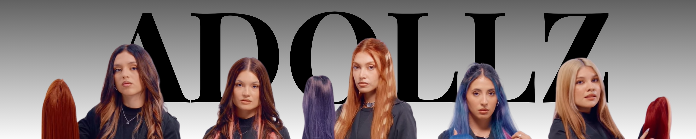
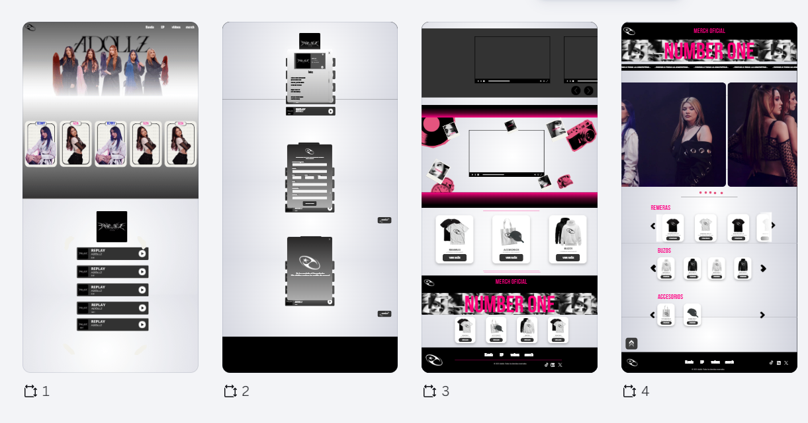
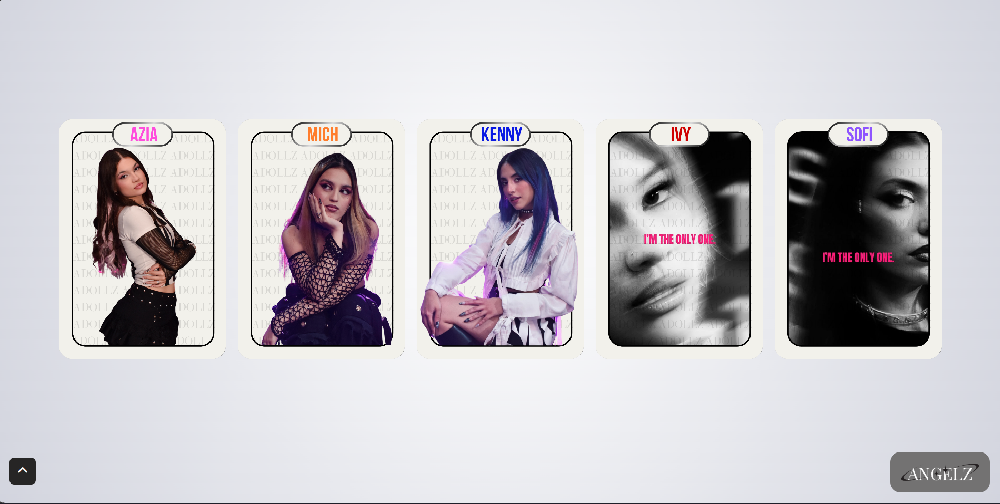
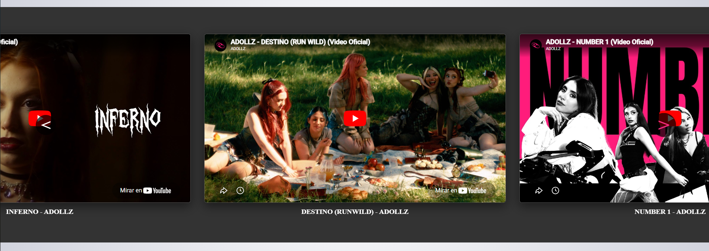
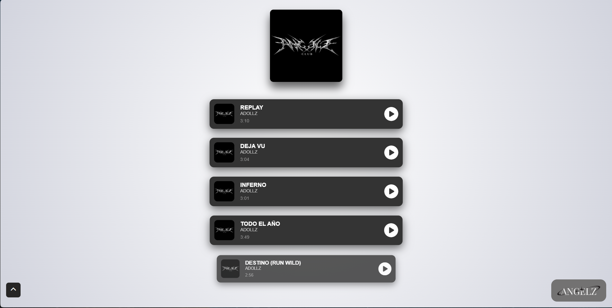
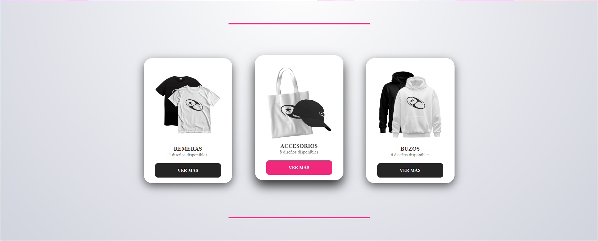
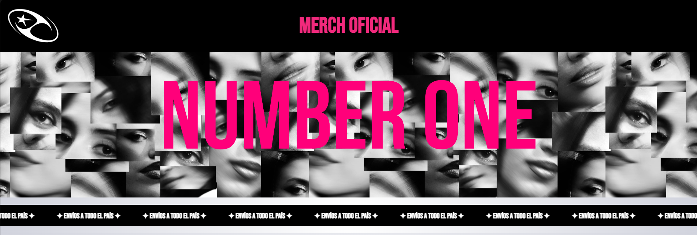
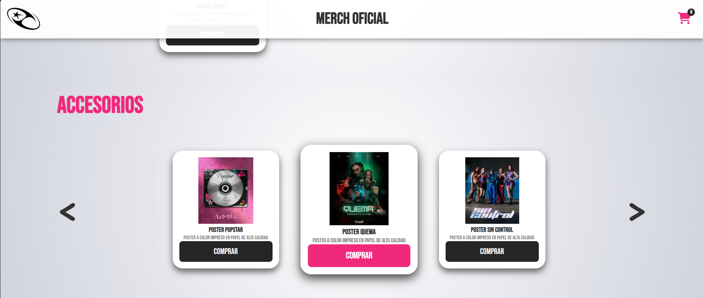

# 💫 [Proyecto Adollz Oficial - Talento Tech](https://julianagrajeda.github.io/Proyecto_ADOLLZoficial_JulianaGrajeda/index.html)

## 💻 Desarrollador/a
- Juliana Gimena Grajeda | grajedajulianagimena+academico@gmail.com
## Información del Curso
### 🌃 Turno
- Talento Tech, clase de los Martes y Jueves. Turno noche (19 a 21hs).
### 👨‍🏫 Docentes 👩‍🏫
- **Instructor**: Nicolás Fernández | nicolas.fernandez4@bue.edu.ar
- **Tutora**: Érica Sosa | erica.sosa@bue.edu.ar
## ⚙️ Información del Proyecto
### Descripción
Este proyecto es una página web para el grupo musical argentino "Adollz". Este sitio fue pensado y desarrollado desde cero en busca de ser un espacio
interactivo donde los fanáticos puedan acceder al contenido oficial de la banda, incluyendo:

- **Comunidad & Redes:** Enlaces a todas sus redes sociales oficiales.

 
  
- **Sección Multimedia:** Acceso directo a sus videos musicales.

- **Discografía:** Espacio dedicado a la presentación de su mini álbum.

- **Tienda(Merch):** Una sección de Merchandising exclusivo diseñado y desarrollado por mi para simular la experiencia de una tienda oficial de la banda.

## 🛠️ Tecnologías Utilizadas
- HTML5
- CSS
